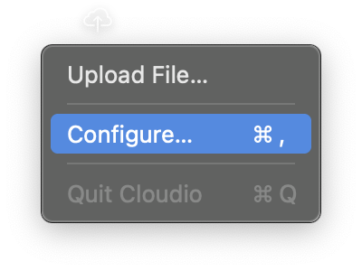
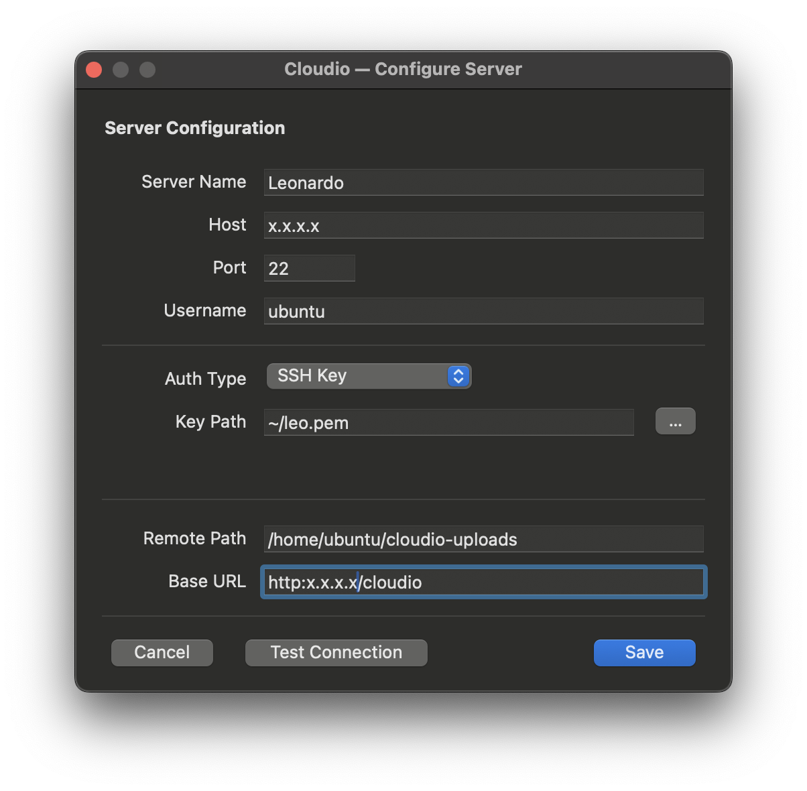
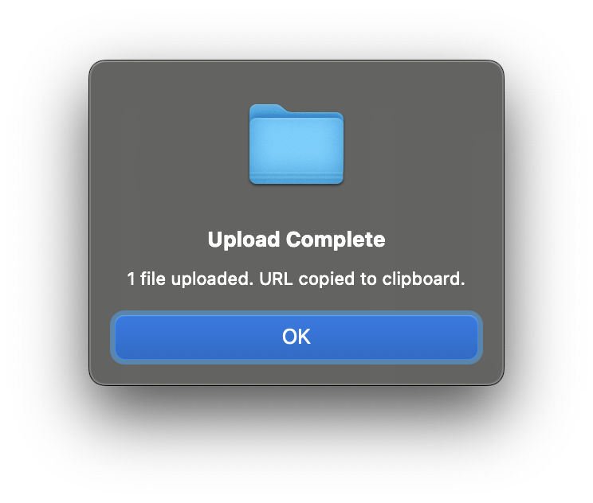

# Cloudio

Drop a file, get a link.

Cloudio is a lightweight tray/menu bar app that uploads files to your own server and gives you a shareable URL. That's it. No accounts, no subscriptions, no 47 features you didn't ask for.

If you used CloudApp back when it was good — before it became a bloated screenshot-annotation-video-recording-workspace-collaboration platform — this is that. The original idea, done right: drag a file, get a link, move on with your life.

**Your server, your files, your links.**



## Platform support

| Platform | Status | UI |
|---|---|---|
| **Linux** | Fully supported | GTK3 system tray + floating drop zone |
| **macOS** | Available (branch `platform/macos`) | Native menu bar icon — drag files directly onto it |
| Windows | Not yet | — |

## How it works

1. A cloud icon lives in your system tray (Linux) or menu bar (macOS)
2. Drag a file onto the icon — or pick one from the menu
3. File uploads to your server via SCP
4. The public URL is copied to your clipboard
5. Done

No Electron. No daemon eating your RAM. No cloud service that'll sunset next quarter. Just ~400 lines of Python and `scp` to move your file. Uses zero CPU when idle.

---

## Linux

### Requirements

- A GTK3 desktop (GNOME, Cinnamon, XFCE, etc.)
- Python 3
- A server with SSH access and a web server (nginx, Apache, Caddy…)

System packages:
```
python3-gi gir1.2-gtk-3.0 gir1.2-ayatanaappindicator3-0.1 openssh-client
```
Password auth also needs `sshpass`.

### Install

```bash
./install.sh
```

Installs dependencies, sets up autostart on login, and launches the app. After that it lives in your system tray.

### Run manually

```bash
python3 cloudio.py
```

---

## macOS

### Requirements

- macOS 11 (Big Sur) or later recommended — older versions work but the menu bar icon uses SF Symbols
- Python 3 (comes with macOS or install via `brew install python`)
- `pyobjc` (installed automatically by the installer)
- A server with SSH access and a web server

### Install

```bash
# Switch to the macOS branch first
git checkout platform/macos

bash macos/install_mac.sh
```

The installer:
1. Installs `pyobjc` via pip
2. Creates `~/.config/cloudio/config.json` from the example template
3. Installs a LaunchAgent so Cloudio starts automatically on login
4. Launches the app immediately

The cloud icon will appear in your menu bar.

### Configure

Click the cloud icon → **Configure…** to open the settings window. Fill in your server details and click **Test Connection** to verify before saving.



Or edit `~/.config/cloudio/config.json` directly (see the [Config reference](#config-reference) below).

### Usage on macOS

**Drag and drop:** Drag any file directly onto the cloud icon in the menu bar. It highlights to confirm the drop. The upload starts immediately.

**Menu upload:** Click the icon → **Upload File…** to pick files via the standard open dialog.

**During upload** the icon shows `↑ filename` so you know something is happening.



---

## Server setup (required)

Cloudio uploads files to **your own VPS** via SCP and serves them over HTTP/S. You need two things on the server before Cloudio will work:

### 1. A public directory served by nginx (or any web server)

Create a directory for uploads and tell nginx to serve it publicly:

```bash
# On your server
mkdir -p ~/cloudio-uploads
```

Add a location block to your nginx site config:

```nginx
location /cloudio/ {
    alias /home/ubuntu/cloudio-uploads/;
    autoindex off;
}
```

```bash
sudo nginx -t && sudo systemctl reload nginx
```

> **Important:** The `base_url` you configure must resolve to this server.
> If your domain points to a different machine (CDN, load balancer, etc.),
> use the server's direct IP or a hostname that actually maps to it.

### 2. SSH access

Cloudio uploads files using `scp`. Your server needs an SSH user that can write to the `remote_path` directory. SSH key auth is recommended.

---

## Config reference

Both platforms read from the same JSON config file.

- **Linux:** `config.json` next to `cloudio.py` (gitignored)
- **macOS:** `~/.config/cloudio/config.json`

```json
{
    "server": {
        "name": "my-server",
        "host": "your.server.ip",
        "port": 22,
        "user": "ubuntu",
        "auth_type": "key",
        "key_path": "~/.ssh/id_rsa"
    },
    "remote_path": "/home/ubuntu/cloudio-uploads",
    "base_url": "https://yourdomain.com/cloudio"
}
```

| Field | Description | Example |
|---|---|---|
| `server.name` | Friendly display name | `production`, `do-nyc` |
| `server.host` | IP address or hostname — must be the server where files are uploaded | `143.198.42.10`, `myserver.com` |
| `server.port` | SSH port | `22` |
| `server.user` | SSH username | `ubuntu`, `root`, `deploy` |
| `server.auth_type` | `"key"` or `"password"` | `"key"` |
| `server.key_path` | Path to SSH private key (when `auth_type=key`) | `~/.ssh/id_ed25519` |
| `server.password` | Password (when `auth_type=password`) | `"hunter2"` |
| `remote_path` | Directory on the server where uploaded files are stored — must match the nginx `alias` path | `/home/ubuntu/cloudio-uploads` |
| `base_url` | Public URL prefix for generated links — must point to the same server as `host` | `http://143.198.42.10/cloudio`, `https://files.mysite.com` |

> **`remote_path` and `base_url` must match.** If nginx serves `/home/ubuntu/cloudio-uploads/` at `/cloudio/`, then `remote_path` is `/home/ubuntu/cloudio-uploads` and `base_url` ends with `/cloudio`.

### Password auth note

Password auth requires `sshpass` (Linux: `sudo apt install sshpass`, macOS: `brew install sshpass`). The password is passed via environment variable, not CLI arguments, so it won't appear in `ps` output. SSH keys are recommended.

---

## Why

CloudApp was perfect in 2012. Drag a file to the menu bar, get a link. Then it got acquired, added teams and workspaces and annotations and screen recording and video messaging and became $16/month for something that used to be simple and free.

Cloudio is the app CloudApp should have stayed. You own the server. You own the files. There's no service to cancel. It does one thing and it does it well.

## License

MIT
